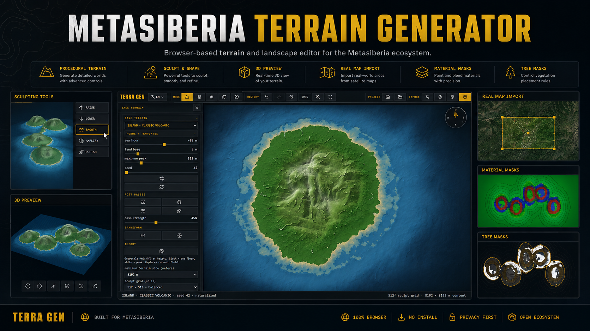
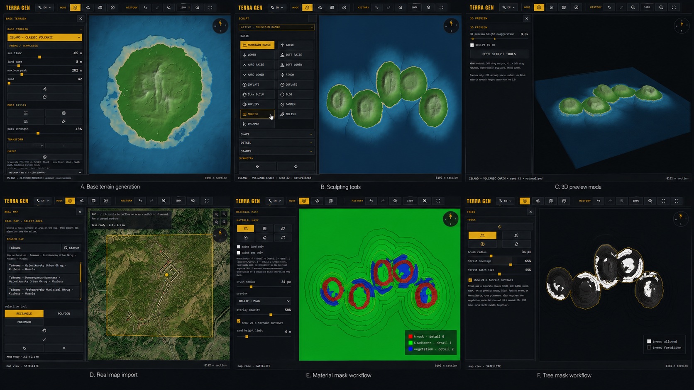
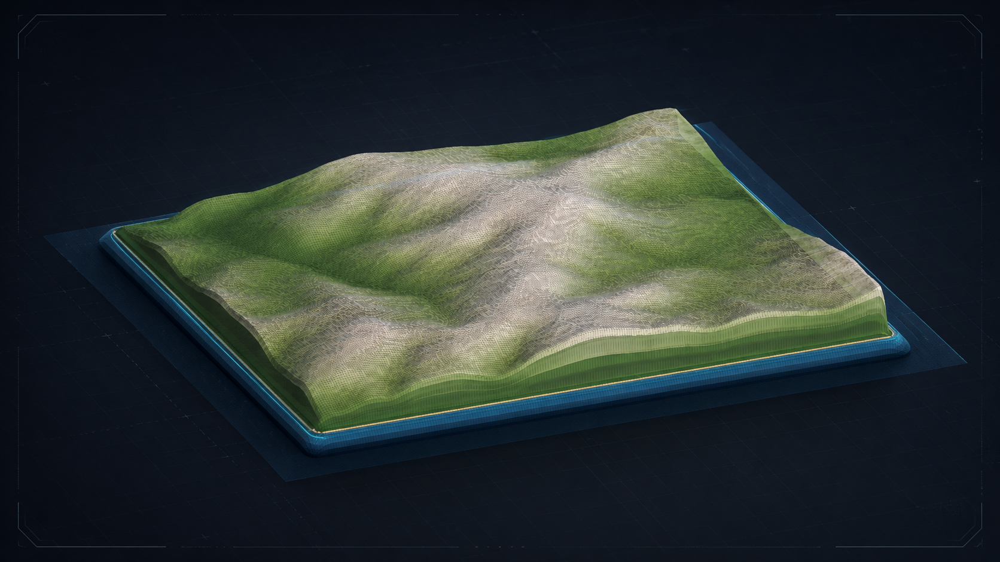
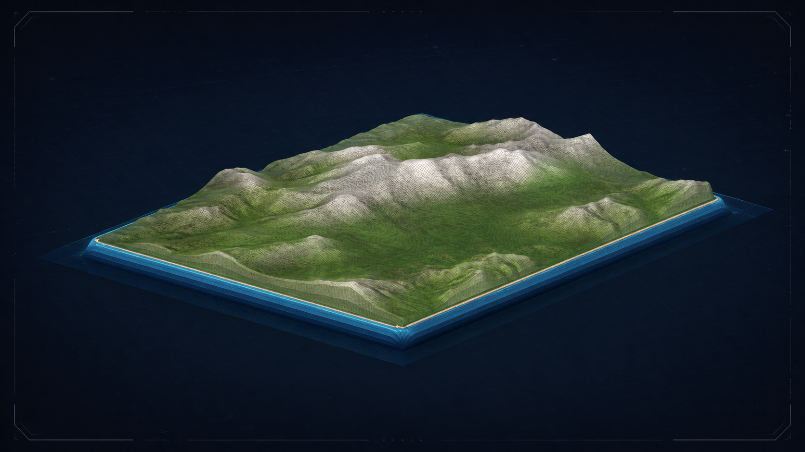
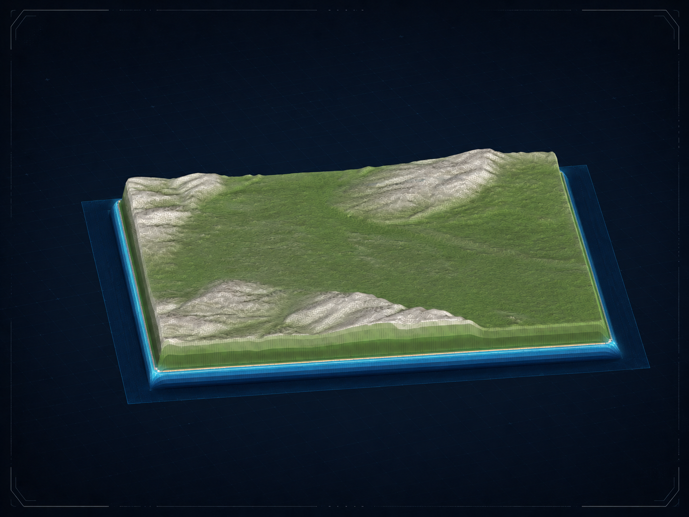
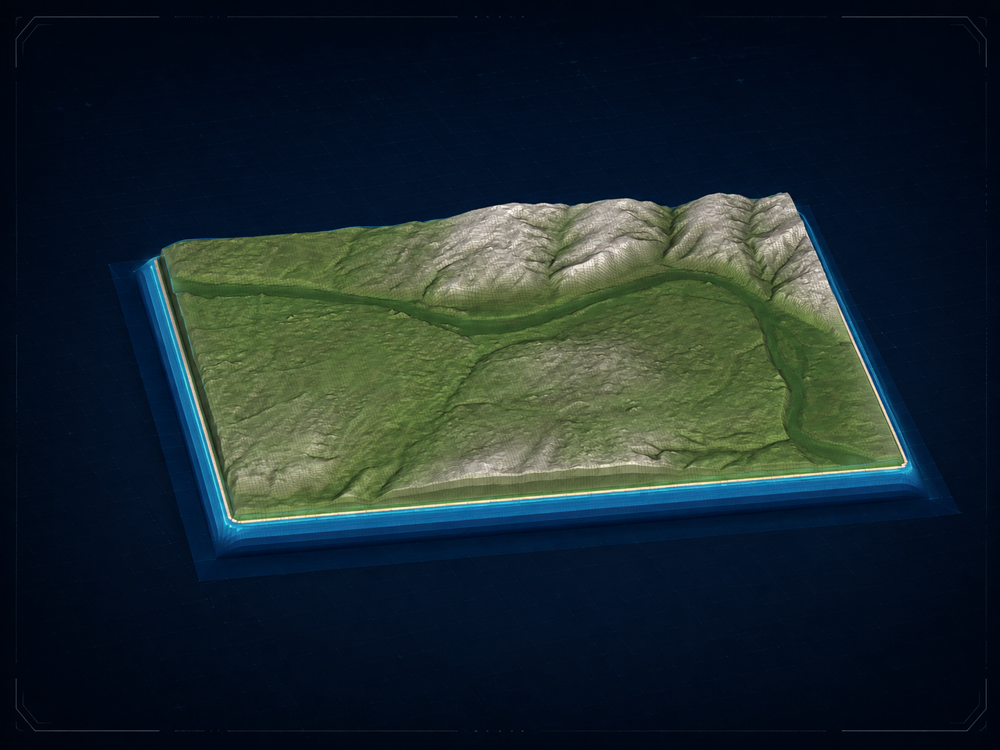
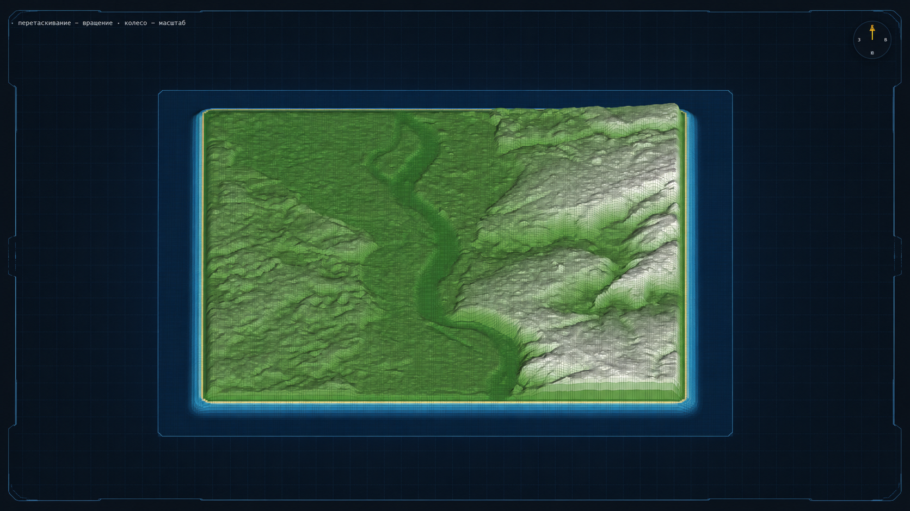
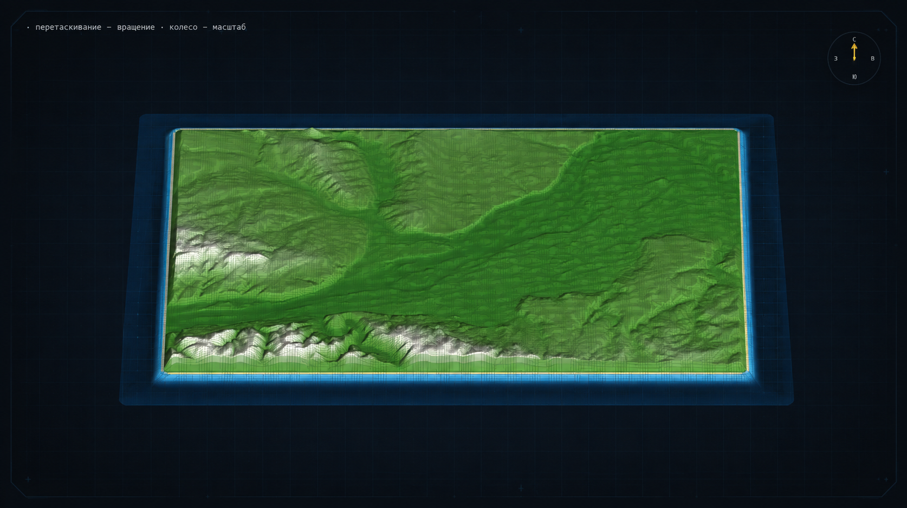
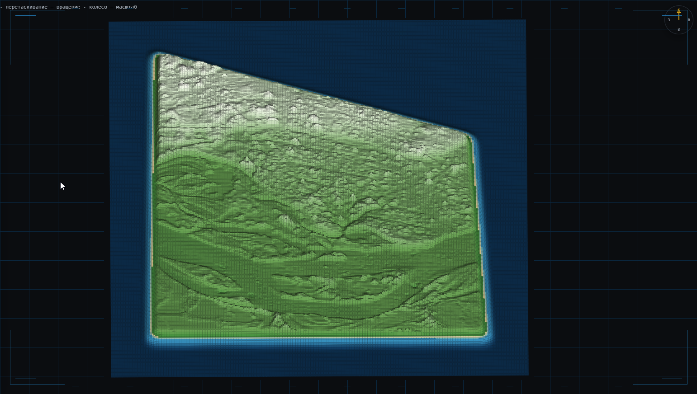

# METASIBERIA TERRAIN GENERATOR

**Browser-based terrain and landscape editor for the Metasiberia ecosystem.**

## About

**Metasiberia Terrain Generator (TERRA GEN)** is a browser-based environment for creating procedural and real-world terrain for **Metasiberia**.

The editor combines procedural terrain generation, manual sculpting, geographic data import, material and vegetation masks, roads and buildings, 3D preview, and Metasiberia-compatible export in a single interface.

Terrain can be created entirely from scratch or generated from real geographic data and then edited directly in the browser.

### Live Editor

[**https://terragen.metasiberia.com/**](https://terragen.metasiberia.com/)

  

## Features

### Procedural Terrain Generation

Create terrain from a large collection of procedural presets and templates.

Available terrain types include:

- volcanic islands;
- archipelagos;
- atolls;
- continents;
- mountain landscapes;
- fjords;
- canyons;
- craters and calderas;
- river deltas;
- tectonic rifts;
- dune fields;
- coral chains;
- experimental and unreal terrain forms.

Terrain generation can be controlled with parameters such as world size, sea level, land height, maximum elevation, and procedural seed.

### Terrain Sculpting

TERRA GEN includes a large set of sculpting tools for manual terrain editing.

Tools include:

- raise and lower;
- mountain range;
- smooth and sharpen;
- inflate and deflate;
- flatten and plateau;
- cliffs and ridges;
- basins and gorges;
- rivers and channels;
- lakes;
- coastlines and beaches;
- erosion;
- terraces;
- deposits;
- noise and terrain detail;
- terrain stamps;
- symmetry tools.

Generated terrain and imported real-world terrain can both be sculpted and modified.

### Real-World Terrain

Real geographic terrain can be imported directly from the built-in map.

Users can:

- search for real places;
- switch between street, satellite, and topographic maps;
- select an area using rectangle, polygon, or freehand tools;
- import real elevation data;
- load roads;
- load building footprints;
- convert the selected area into an island if needed;
- continue editing the imported terrain with the full sculpting toolset.

The editor reconstructs real terrain inside the TerrainGen workspace while keeping it fully editable.

### Materials

Terrain materials are controlled through an RGB material mask designed for the Metasiberia terrain system.

The channels represent:

- **R** — rock;
- **G** — sediment / sand;
- **B** — vegetation.

Material masks can be generated automatically from terrain height and slope or edited manually with brushes.

### Trees & Vegetation

Vegetation placement uses a separate black-and-white tree mask.

Users can:

- generate forests automatically;
- paint areas where trees are allowed;
- block vegetation;
- erase manual edits;
- control forest density;
- control forest patch size.

Tree placement is coordinated with the vegetation material channel.

### 3D Preview

Terrain can be inspected directly in an interactive 3D preview.

The preview supports:

- orbit;
- zoom;
- pan;
- adjustable height visualization;
- terrain sculpting directly in 3D.

## Metasiberia Export

TerrainGen produces a set of files prepared for the **Metasiberia** terrain workflow.

### Height Map

`terra_gen_height.exr`

Floating-point terrain elevation stored in **EXR** format.

### Material Mask

`terra_gen_material_mask.png`

RGB material classification for rock, sediment, and vegetation.

### Tree Mask

`terra_gen_tree_mask.png`

Black-and-white vegetation placement mask.

### Road Mask

`terra_gen_roads_mask.png`

Rasterized road data imported from geographic sources.

### Building Mask

`terra_gen_buildings_mask.png`

Rasterized building footprints imported from geographic sources.

All export files can also be generated together as a single ZIP package.

## Additional Tools

The editor also includes:

- project save and load;
- Undo / Redo history;
- terrain mirroring;
- brush presets;
- heightmap PNG import;
- adjustable sculpt resolution;
- adjustable export resolution;
- high-resolution road and building masks;
- English and Russian interface;
- Metasiberia-compatible terrain dimensions and export settings.

## Metasiberia Ecosystem

**Metasiberia Terrain Generator** is part of the **Metasiberia** ecosystem — a collection of interconnected tools for creating virtual environments, avatars, landscapes, and digital content.

### Metasiberia

Main virtual environment and core project.

**Website:**  
[https://metasiberia.com/](https://metasiberia.com/)

**GitHub:**  
https://github.com/shipilovden/sub-metasiberia

### Metasiberia Terrain Generator

Browser-based terrain generation and landscape editing.

**Editor:**  
[https://terragen.metasiberia.com/](https://terragen.metasiberia.com/)

**GitHub:**  
https://github.com/shipilovden/terragen.metasiberia

### Metasiberia Avatars Creator

Browser-based 3D avatar customization and texture editing.

**Editor:**  
[https://avatars.metasiberia.com/](https://avatars.metasiberia.com/)

**GitHub:**  
https://github.com/shipilovden/avatars.metasiberia

## Author

**Denis Shipilov**

Creator and developer of **Metasiberia**, **Metasiberia Terrain Generator**, and **Metasiberia Avatars Creator**.

**GitHub:**  
https://github.com/shipilovden

**Telegram:**  
[https://t.me/denshipilov_metasiberia](https://t.me/denshipilov_metasiberia)

**Twitter (X):**  
[https://twitter.com/denshipilovart](https://twitter.com/denshipilovart)

**Metasiberia:**  
[https://metasiberia.com/](https://metasiberia.com/)

## Real-World Terrain Examples

Examples of real terrain reconstructed from geographic elevation data and imported into **Metasiberia Terrain Generator**.

The terrain geometry is based on real-world elevation data and can be further edited using the TerrainGen sculpting tools.

  
   
  <strong>Tayzhina</strong> — Kemerovo Region, Russia

 

  
   
  <strong>Sheregesh</strong> — Kemerovo Region, Russia

 

  
   
  <strong>Novokuznetsk</strong> — Kemerovo Region, Russia

 

  
   
  <strong>Kemerovo</strong> — Kemerovo Region, Russia

 

  
   
  <strong>Tomsk</strong> — Tomsk Region, Russia

 

  
   
  <strong>Krasnoyarsk</strong> — Krasnoyarsk Krai, Russia

 

  
   
  <strong>Surgut</strong> — Khanty-Mansi Autonomous Okrug — Yugra, Russia

---

  <strong>METASIBERIA</strong> 
  Create terrain. Create space. Create your virtual world.

